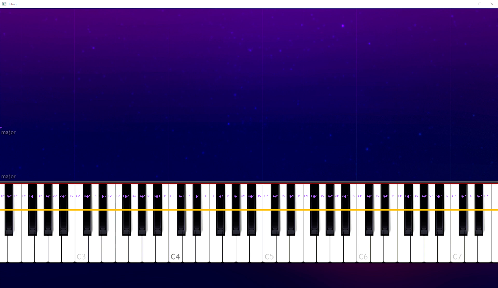

[](https://github.com/SoloSteve/magic-search/issues)
[]()
# copycat
**Synthesia Video Converter**

Download a video of a Synthesia song, run it through the program, and receive the sheet music!

### Basic Tutorial
> This program is in its early stages so don't expect very high quality output at this time

Program Arguments
```text
(venv) >python -m copycat.main --help

usage: main.py [-h] --file PATH [--tempo TEMPO] {manual} ...

positional arguments:
  {manual}

required arguments:
 -f PATH, --file PATH  The path of the mp4 synthesia video
 -t TEMPO, --tempo TEMPO  The tempo of the piece in BPM

optional arguments:
  -h, --help     show this help message and exit
```

At the moment, the only supported parsing format is manual,
meaning the program requires more basic information 

```text
(venv) >python -m copycat.main manual --help
usage: main.py manual [-h] --bounds X Y WIDTH HEIGHT --first-key NOTE [--skip-frames SKIP_FRAMES] [--detector-line-offset DETECTOR_LINE_OFFSET]
                      [--min-speed MIN_SPEED] [--debug]

optional arguments:
  -h, --help            show this help message and exit
  --bounds X Y WIDTH HEIGHT
                        The boundaries around the piano keys space separated
  --first-key NOTE      The first white key in the bounds.
  --skip-frames SKIP_FRAMES
                        How many frame to skip in case there is an introduction
  --detector-line-offset DETECTOR_LINE_OFFSET
                        Number of pixels from the top of the boundary to offset the detector line
  --min-speed MIN_SPEED
                        Defines a minimum note duration
  --debug               Show debugged version

(venv) F:\Development\copycat>
```

The only required arguments are **bounds** and **first key**.

### Example
Here is an example of a song with the correct parameters running in debug mode (`--debug`)

`main.py --file /tmp/taylor_swift.mp4 manual --bounds "20 632 1780 200" --first-key A2 --skip-frames 150 --debug`



##### Explained
1. The green rectangle is the `--bounds` property. It should begin at a white key.
2. The orange line is the detection line `--detector-line-offset`. It is where the key detection actually happens. Make sure no *special effects* are seen at this line.
3. The purple key text has been placed above the respective key.

If everything looks good you can run without the `--debug` flag

Take the output string when the program finishes and paste it into your favorite
[abc notation editor](https://www.abcjs.net/abcjs-editor.html)